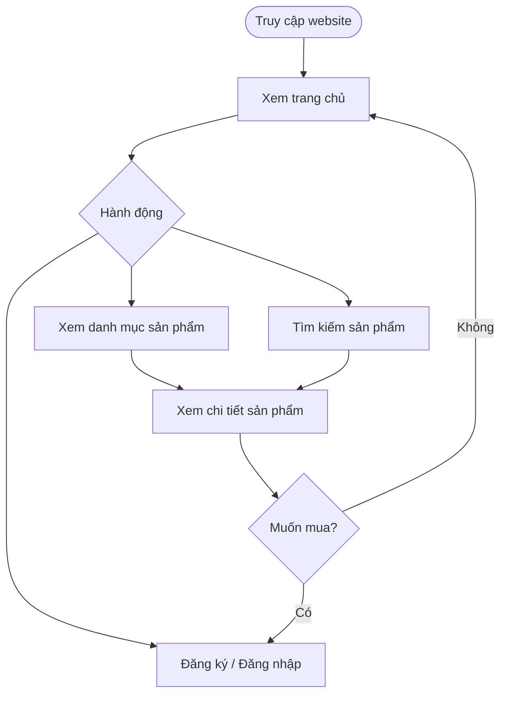
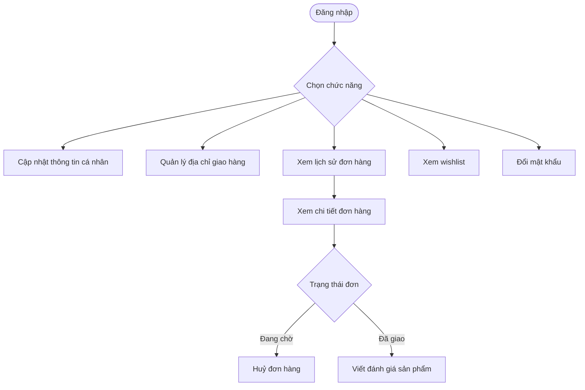
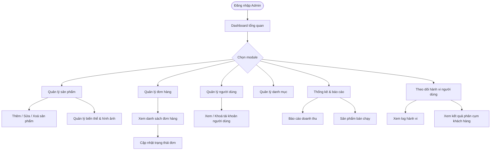

# User Flow - Luồng người dùng

Mô tả hành trình của từng đối tượng người dùng khi tương tác với hệ thống.

---

## 1. Khách vãng lai



---

## 2. Người dùng đã đăng ký - Luồng mua hàng

```mermaid
h
```

---

## 3. Người dùng đã đăng ký - Luồng quản lý tài khoản



---

## 4. Quản trị viên


