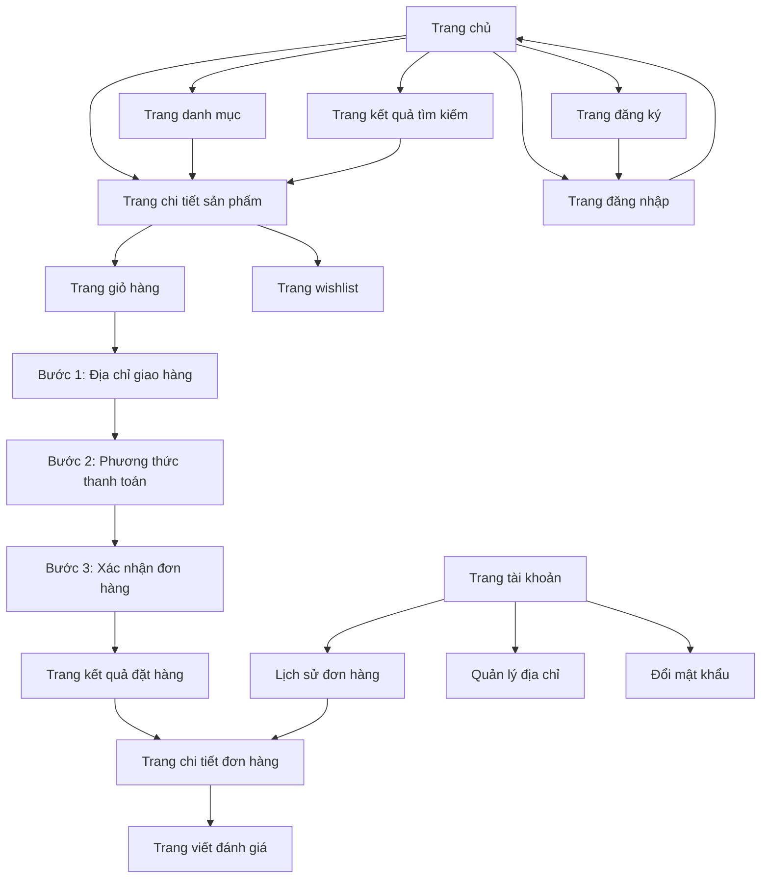
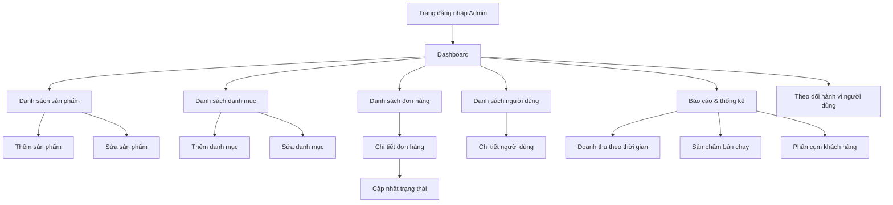

# Screen Flow - Luồng màn hình

Mô tả các trang/màn hình và cách chuyển đổi giữa chúng.

---

## 1. Phân hệ người dùng (Customer)

---

## 2. Phân hệ quản trị (Admin)

---

## 3. Sơ đồ điều hướng tổng thể

```mermaid
flowchart LR
    subgraph Public["Công khai (chưa đăng nhập)"]
        HOME
        CATEGORY
        PRODUCT
        SEARCH
        LOGIN
        REGISTER
    end

    subgraph Customer["Người dùng đã đăng nhập"]
        CART
        CHECKOUT
        ORDER_HISTORY
        PROFILE
        WISHLIST
    end

    subgraph Admin["Quản trị viên"]
        DASHBOARD
        PROD_MGMT[Quản lý sản phẩm]
        ORDER_MGMT[Quản lý đơn hàng]
        USER_MGMT[Quản lý người dùng]
        REPORT
    end

    Public -->|Đăng nhập| Customer
    Public -->|Đăng nhập Admin| Admin
    Customer -->|Đăng xuất| Public
    Admin -->|Đăng xuất| Public
```

