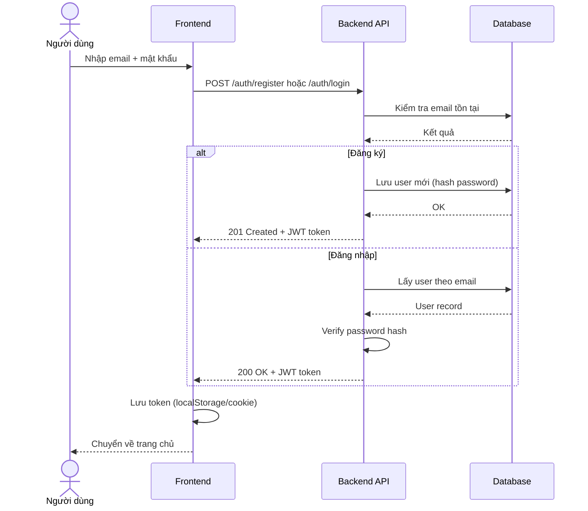
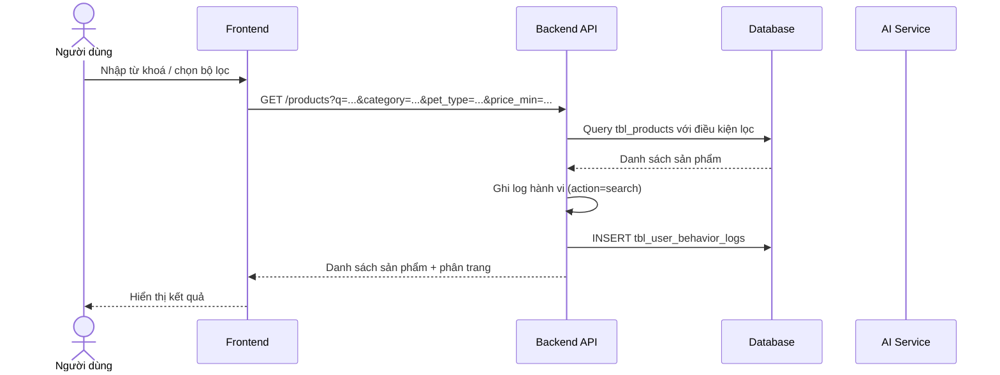
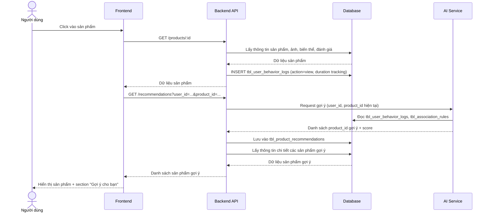
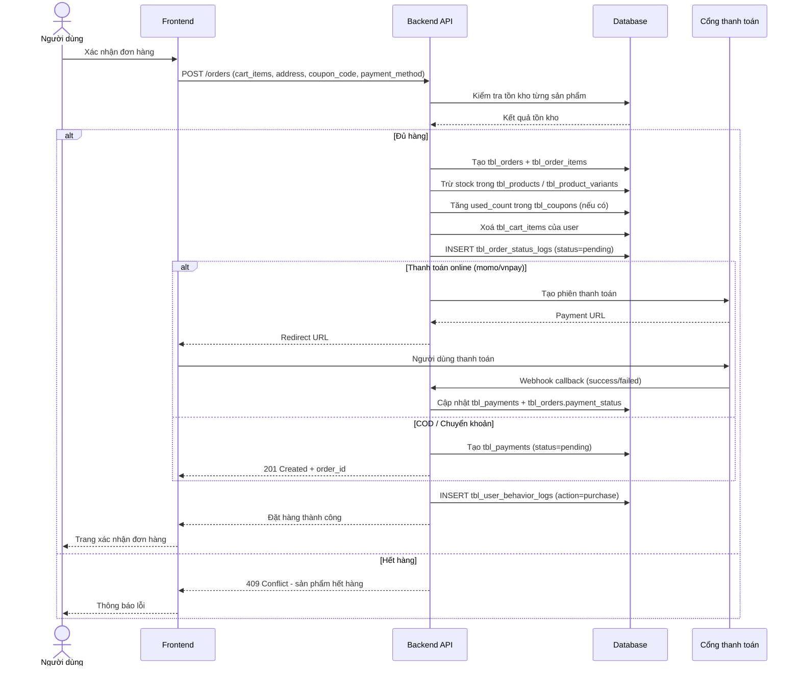
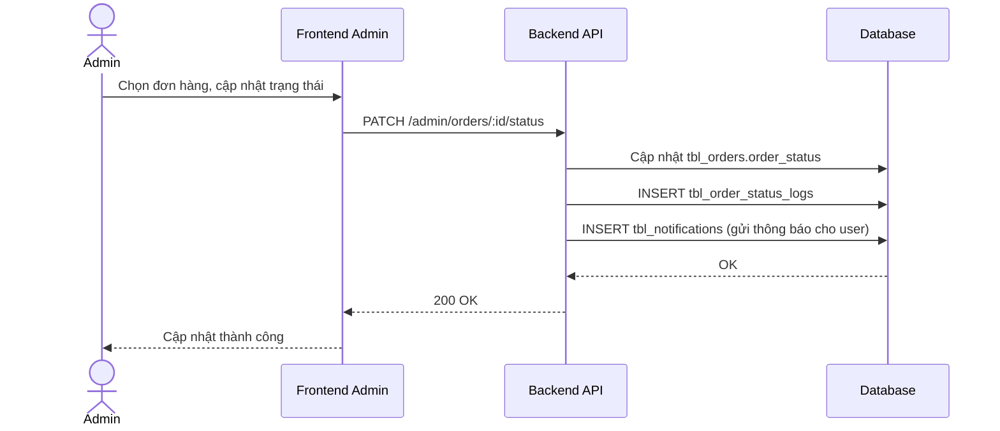
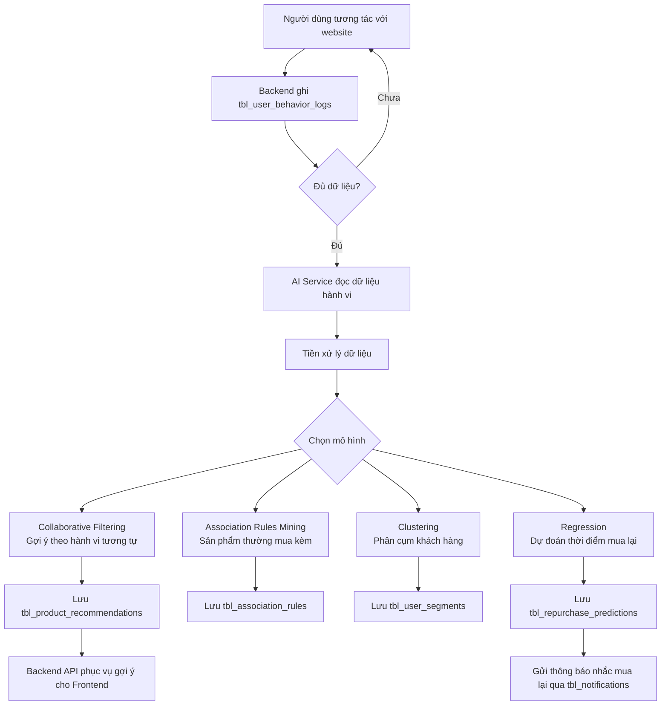
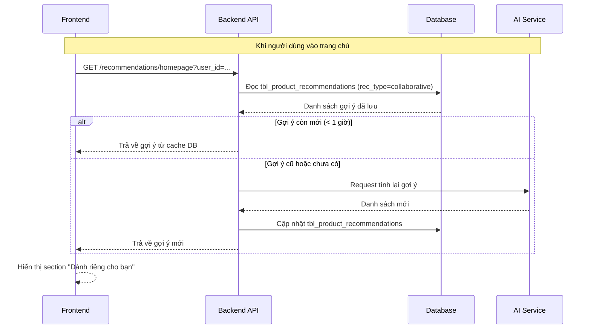

# System Flow - Luồng hệ thống

Mô tả tương tác giữa các thành phần: Frontend, Backend API, Database, AI Service.

---

## 1. Đăng ký & Đăng nhập

---

## 2. Tìm kiếm & Lọc sản phẩm

---

## 3. Xem chi tiết sản phẩm & Gợi ý AI

---

## 4. Đặt hàng & Thanh toán

---

## 5. Cập nhật trạng thái đơn hàng (Admin)

---

## 6. Hệ thống AI - Thu thập & Huấn luyện

---

## 7. Luồng gợi ý sản phẩm theo thời gian thực

