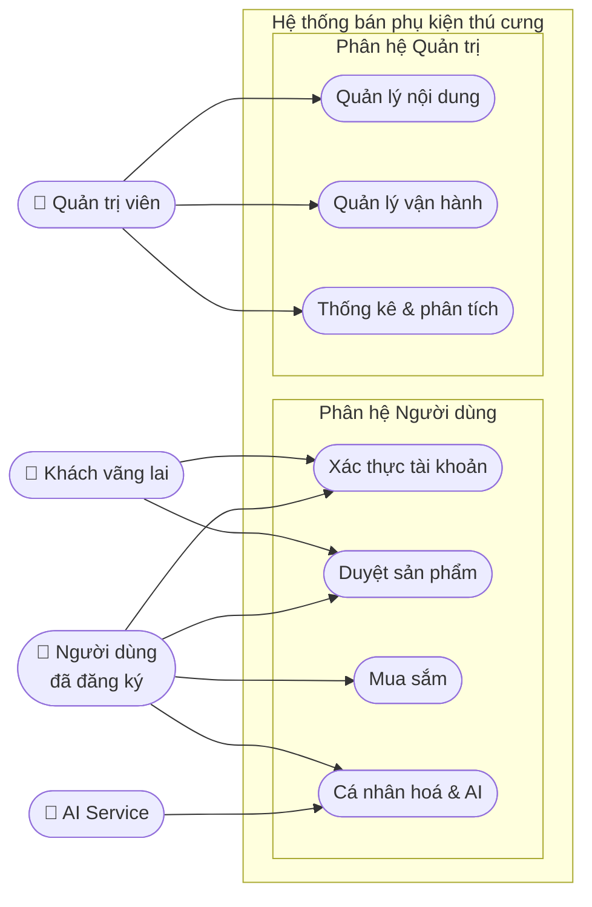
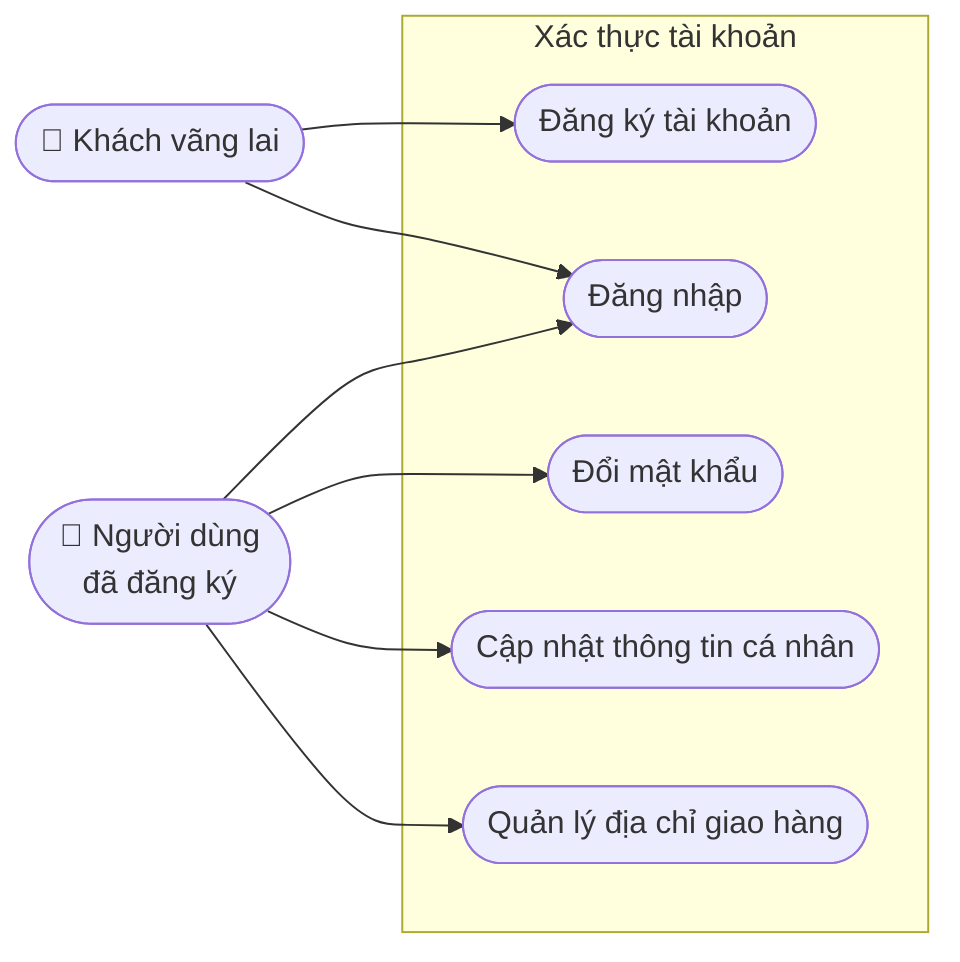
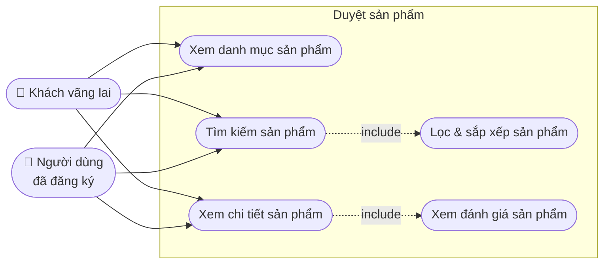
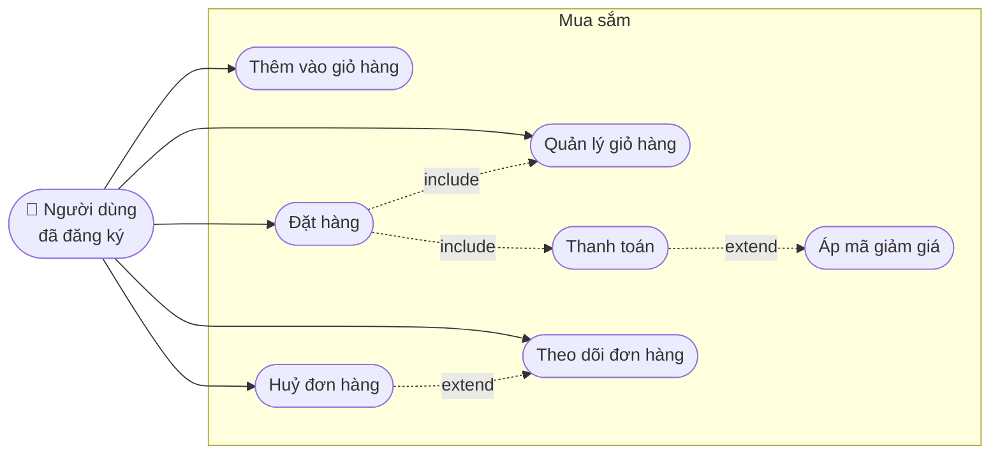
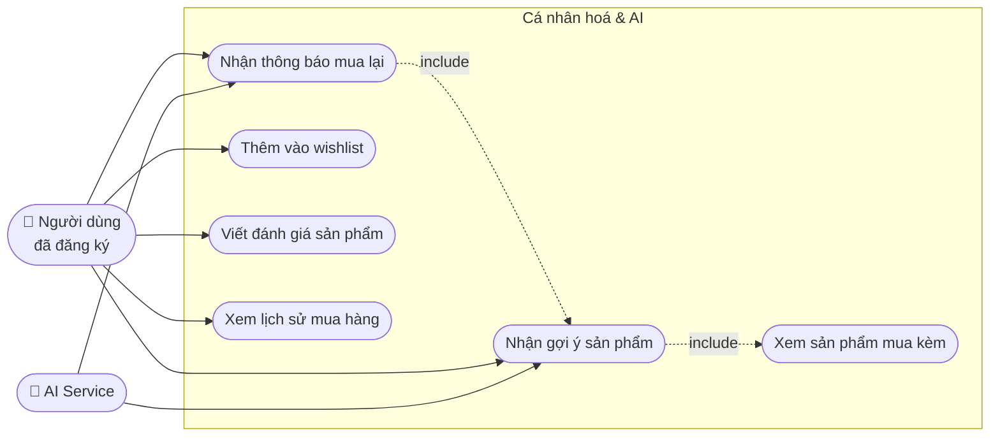
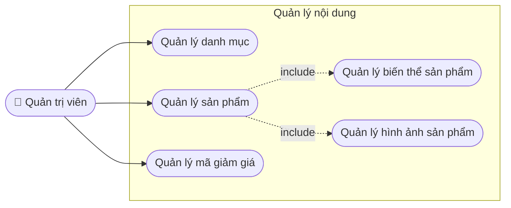
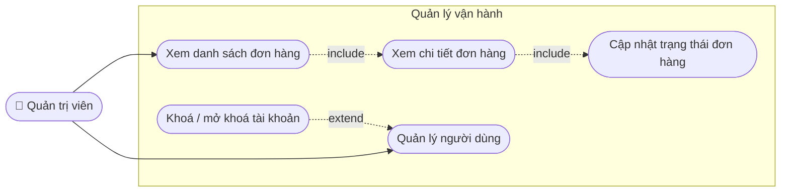
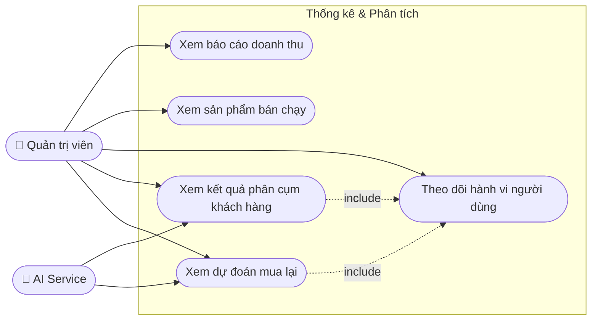

# Use Case Diagram - Biểu đồ Use Case

---

# PHẦN 1: BIỂU ĐỒ USE CASE TỔNG QUÁT

---

# PHẦN 2: PHÂN HỆ NGƯỜI DÙNG

---

## UC-ND-01: Xác thực tài khoản

### Luồng sự kiện: Đăng ký tài khoản

| | |
|---|---|
| Actor | Khách vãng lai |
| Tiền điều kiện | Chưa có tài khoản |
| Hậu điều kiện | Tài khoản được tạo, người dùng đăng nhập thành công |

| Bước | Người dùng | Hệ thống |
|---|---|---|
| 1 | Truy cập trang đăng ký | |
| 2 | Nhập họ tên, email, mật khẩu | |
| 3 | Nhấn "Đăng ký" | |
| 4 | | Kiểm tra email đã tồn tại chưa |
| 5 | | Mã hoá mật khẩu, lưu tài khoản |
| 6 | | Trả về token, chuyển về trang chủ |

**Luồng thay thế:** Email đã tồn tại → hiển thị lỗi, yêu cầu nhập email khác.

---

### Luồng sự kiện: Đăng nhập

| | |
|---|---|
| Actor | Khách vãng lai / Người dùng đã đăng ký |
| Tiền điều kiện | Đã có tài khoản |
| Hậu điều kiện | Người dùng được xác thực, nhận JWT token |

| Bước | Người dùng | Hệ thống |
|---|---|---|
| 1 | Nhập email + mật khẩu | |
| 2 | Nhấn "Đăng nhập" | |
| 3 | | Tìm tài khoản theo email |
| 4 | | Xác minh mật khẩu |
| 5 | | Tạo JWT token, trả về |
| 6 | | Chuyển hướng về trang trước đó |

**Luồng thay thế:** Sai mật khẩu → hiển thị lỗi. Tài khoản bị khoá → thông báo liên hệ admin.

---

## UC-ND-02: Duyệt sản phẩm

### Luồng sự kiện: Tìm kiếm & lọc sản phẩm

| | |
|---|---|
| Actor | Khách vãng lai / Người dùng đã đăng ký |
| Tiền điều kiện | Đang ở bất kỳ trang nào của website |
| Hậu điều kiện | Danh sách sản phẩm phù hợp được hiển thị, hành vi được ghi log |

| Bước | Người dùng | Hệ thống |
|---|---|---|
| 1 | Nhập từ khoá vào ô tìm kiếm | |
| 2 | | Gợi ý từ khoá (autocomplete) |
| 3 | Nhấn tìm kiếm | |
| 4 | | Truy vấn sản phẩm theo từ khoá |
| 5 | | Ghi log hành vi tìm kiếm |
| 6 | | Trả về danh sách + phân trang |
| 7 | Chọn bộ lọc (danh mục, loại thú, giá) | |
| 8 | | Lọc lại kết quả theo điều kiện |
| 9 | | Hiển thị kết quả đã lọc |

---

### Luồng sự kiện: Xem chi tiết sản phẩm

| | |
|---|---|
| Actor | Khách vãng lai / Người dùng đã đăng ký |
| Tiền điều kiện | Đang ở trang danh sách hoặc kết quả tìm kiếm |
| Hậu điều kiện | Thông tin sản phẩm hiển thị đầy đủ, hành vi xem được ghi log |

| Bước | Người dùng | Hệ thống |
|---|---|---|
| 1 | Click vào sản phẩm | |
| 2 | | Tải thông tin sản phẩm, biến thể, hình ảnh |
| 3 | | Tải đánh giá sản phẩm |
| 4 | | Ghi log hành vi xem (action=view) |
| 5 | | Gọi AI lấy danh sách gợi ý liên quan |
| 6 | | Hiển thị toàn bộ thông tin + gợi ý |
| 7 | Chọn biến thể (màu, size) | |
| 8 | | Cập nhật giá và tồn kho theo biến thể |

---

## UC-ND-03: Mua sắm

### Luồng sự kiện: Thêm vào giỏ hàng

| | |
|---|---|
| Actor | Người dùng đã đăng ký |
| Tiền điều kiện | Đã đăng nhập, đang xem chi tiết sản phẩm |
| Hậu điều kiện | Sản phẩm được thêm vào giỏ hàng |

| Bước | Người dùng | Hệ thống |
|---|---|---|
| 1 | Chọn biến thể (nếu có), nhập số lượng | |
| 2 | Nhấn "Thêm vào giỏ hàng" | |
| 3 | | Kiểm tra tồn kho |
| 4 | | Thêm hoặc cập nhật số lượng trong giỏ |
| 5 | | Ghi log hành vi (action=add_to_cart) |
| 6 | | Hiển thị thông báo thêm thành công |

**Luồng thay thế:** Chưa đăng nhập → chuyển đến trang đăng nhập. Hết hàng → hiển thị thông báo.

---

### Luồng sự kiện: Đặt hàng & Thanh toán

| | |
|---|---|
| Actor | Người dùng đã đăng ký |
| Tiền điều kiện | Đã đăng nhập, giỏ hàng có ít nhất 1 sản phẩm |
| Hậu điều kiện | Đơn hàng được tạo, tồn kho giảm, giỏ hàng xoá |

| Bước | Người dùng | Hệ thống |
|---|---|---|
| 1 | Vào giỏ hàng, kiểm tra sản phẩm | |
| 2 | Nhấn "Tiến hành đặt hàng" | |
| 3 | Chọn hoặc nhập địa chỉ giao hàng | |
| 4 | Chọn phương thức thanh toán | |
| 5 | Nhập mã giảm giá (tuỳ chọn) | |
| 6 | | Kiểm tra mã giảm giá, tính lại tổng tiền |
| 7 | Xác nhận đơn hàng | |
| 8 | | Kiểm tra tồn kho lần cuối |
| 9 | | Tạo đơn hàng, trừ tồn kho, xoá giỏ hàng |
| 10 | | Tạo bản ghi thanh toán |
| 11 | | (Nếu online) Redirect đến cổng thanh toán |
| 12 | Thực hiện thanh toán (nếu online) | |
| 13 | | Nhận callback, cập nhật trạng thái thanh toán |
| 14 | | Gửi thông báo xác nhận đơn hàng |

**Luồng thay thế:** Thanh toán online thất bại → giữ đơn hàng, cho phép thử lại. Hết hàng ở bước 8 → huỷ đơn, thông báo.

---

### Luồng sự kiện: Theo dõi & Huỷ đơn hàng

| | |
|---|---|
| Actor | Người dùng đã đăng ký |
| Tiền điều kiện | Đã có đơn hàng |
| Hậu điều kiện | Xem được trạng thái / đơn hàng được huỷ |

| Bước | Người dùng | Hệ thống |
|---|---|---|
| 1 | Vào trang lịch sử đơn hàng | |
| 2 | | Hiển thị danh sách đơn hàng theo thời gian |
| 3 | Chọn đơn hàng cụ thể | |
| 4 | | Hiển thị chi tiết + lịch sử trạng thái |
| 5 | Nhấn "Huỷ đơn" (nếu còn trong trạng thái pending) | |
| 6 | | Kiểm tra điều kiện cho phép huỷ |
| 7 | | Cập nhật trạng thái = cancelled, hoàn tồn kho |
| 8 | | Gửi thông báo huỷ đơn thành công |

---

## UC-ND-04: Cá nhân hoá & AI

### Luồng sự kiện: Nhận gợi ý sản phẩm

| | |
|---|---|
| Actor | Người dùng đã đăng ký, AI Service |
| Tiền điều kiện | Đã đăng nhập, có dữ liệu hành vi |
| Hậu điều kiện | Danh sách sản phẩm gợi ý được hiển thị |

| Bước | Người dùng | Hệ thống | AI Service |
|---|---|---|---|
| 1 | Truy cập trang chủ hoặc chi tiết sản phẩm | | |
| 2 | | Gọi API lấy gợi ý cho user | |
| 3 | | Kiểm tra gợi ý còn mới không | |
| 4 | | Nếu cũ: gọi AI Service | |
| 5 | | | Đọc lịch sử hành vi, luật kết hợp |
| 6 | | | Tính điểm gợi ý, trả về danh sách |
| 7 | | Lưu kết quả gợi ý mới vào DB | |
| 8 | | Trả về danh sách sản phẩm | |
| 9 | Xem section "Gợi ý cho bạn" | | |

---

### Luồng sự kiện: Nhận thông báo mua lại

| | |
|---|---|
| Actor | Người dùng đã đăng ký, AI Service |
| Tiền điều kiện | Người dùng đã mua sản phẩm tiêu hao (thức ăn, cát...) |
| Hậu điều kiện | Người dùng nhận thông báo nhắc mua lại đúng thời điểm |

| Bước | Người dùng | Hệ thống | AI Service |
|---|---|---|---|
| 1 | | Chạy job định kỳ kiểm tra dự đoán | |
| 2 | | | Phân tích chu kỳ mua của từng user |
| 3 | | | Lưu predicted_date vào DB |
| 4 | | Kiểm tra các dự đoán đến hạn hôm nay | |
| 5 | | Tạo thông báo nhắc mua lại | |
| 6 | Nhận thông báo trên website | | |
| 7 | Click vào thông báo | | |
| 8 | | Chuyển đến trang sản phẩm tương ứng | |

---

---

# PHẦN 3: PHÂN HỆ QUẢN TRỊ

---

## UC-QT-01: Quản lý nội dung

### Luồng sự kiện: Thêm sản phẩm mới

| | |
|---|---|
| Actor | Quản trị viên |
| Tiền điều kiện | Đã đăng nhập với quyền admin |
| Hậu điều kiện | Sản phẩm mới được lưu và hiển thị trên website |

| Bước | Admin | Hệ thống |
|---|---|---|
| 1 | Vào trang quản lý sản phẩm | |
| 2 | Nhấn "Thêm sản phẩm" | |
| 3 | Nhập tên, mô tả, giá, tồn kho, danh mục, loại thú | |
| 4 | Upload hình ảnh sản phẩm | |
| 5 | Thêm biến thể (nếu có) | |
| 6 | Nhấn "Lưu" | |
| 7 | | Validate dữ liệu đầu vào |
| 8 | | Tự động tạo slug từ tên sản phẩm |
| 9 | | Lưu sản phẩm, biến thể, hình ảnh vào DB |
| 10 | | Hiển thị thông báo thành công |

**Luồng thay thế:** Dữ liệu không hợp lệ → hiển thị lỗi từng trường. SKU trùng → yêu cầu nhập lại.

---

### Luồng sự kiện: Quản lý danh mục

| | |
|---|---|
| Actor | Quản trị viên |
| Tiền điều kiện | Đã đăng nhập với quyền admin |
| Hậu điều kiện | Danh mục được thêm / sửa / xoá |

| Bước | Admin | Hệ thống |
|---|---|---|
| 1 | Vào trang quản lý danh mục | |
| 2 | | Hiển thị cây danh mục (cha - con) |
| 3 | Thêm / sửa / xoá danh mục | |
| 4 | | Validate (không xoá danh mục còn sản phẩm) |
| 5 | | Lưu thay đổi, cập nhật slug |
| 6 | | Hiển thị thông báo kết quả |

---

### Luồng sự kiện: Quản lý mã giảm giá

| | |
|---|---|
| Actor | Quản trị viên |
| Tiền điều kiện | Đã đăng nhập với quyền admin |
| Hậu điều kiện | Mã giảm giá được tạo / cập nhật / vô hiệu hoá |

| Bước | Admin | Hệ thống |
|---|---|---|
| 1 | Vào trang quản lý mã giảm giá | |
| 2 | Nhập code, loại giảm giá, giá trị, điều kiện, thời hạn | |
| 3 | Nhấn "Tạo mã" | |
| 4 | | Kiểm tra code chưa trùng |
| 5 | | Lưu coupon vào DB |
| 6 | | Hiển thị mã vừa tạo |

---

## UC-QT-02: Quản lý vận hành

### Luồng sự kiện: Cập nhật trạng thái đơn hàng

| | |
|---|---|
| Actor | Quản trị viên |
| Tiền điều kiện | Đã đăng nhập admin, đơn hàng tồn tại |
| Hậu điều kiện | Trạng thái đơn được cập nhật, người dùng nhận thông báo |

| Bước | Admin | Hệ thống |
|---|---|---|
| 1 | Tìm kiếm / lọc đơn hàng | |
| 2 | | Hiển thị danh sách đơn hàng |
| 3 | Chọn đơn hàng cụ thể | |
| 4 | | Hiển thị chi tiết đơn + lịch sử trạng thái |
| 5 | Chọn trạng thái mới, nhập ghi chú | |
| 6 | Nhấn "Cập nhật" | |
| 7 | | Lưu trạng thái mới vào tbl_orders |
| 8 | | Ghi log vào tbl_order_status_logs |
| 9 | | Tạo thông báo gửi đến người dùng |
| 10 | | Hiển thị xác nhận thành công |

---

### Luồng sự kiện: Quản lý người dùng

| | |
|---|---|
| Actor | Quản trị viên |
| Tiền điều kiện | Đã đăng nhập admin |
| Hậu điều kiện | Thông tin người dùng được xem / tài khoản bị khoá hoặc mở khoá |

| Bước | Admin | Hệ thống |
|---|---|---|
| 1 | Vào trang quản lý người dùng | |
| 2 | Tìm kiếm theo tên / email | |
| 3 | | Hiển thị danh sách người dùng |
| 4 | Chọn người dùng | |
| 5 | | Hiển thị thông tin + lịch sử đơn hàng |
| 6 | Nhấn "Khoá tài khoản" (nếu cần) | |
| 7 | | Cập nhật is_active = 0 |
| 8 | | Huỷ token hiện tại của người dùng |
| 9 | | Hiển thị xác nhận |

---

## UC-QT-03: Thống kê & Phân tích

### Luồng sự kiện: Xem báo cáo doanh thu

| | |
|---|---|
| Actor | Quản trị viên |
| Tiền điều kiện | Đã đăng nhập admin |
| Hậu điều kiện | Báo cáo doanh thu theo khoảng thời gian được hiển thị |

| Bước | Admin | Hệ thống |
|---|---|---|
| 1 | Vào trang thống kê | |
| 2 | Chọn khoảng thời gian (ngày/tuần/tháng) | |
| 3 | | Truy vấn tổng doanh thu, số đơn, sản phẩm bán chạy |
| 4 | | Hiển thị biểu đồ doanh thu theo thời gian |
| 5 | | Hiển thị top sản phẩm bán chạy |
| 6 | Admin xuất báo cáo (tuỳ chọn) | |
| 7 | | Xuất file CSV / PDF |

---

### Luồng sự kiện: Xem kết quả phân cụm khách hàng

| | |
|---|---|
| Actor | Quản trị viên, AI Service |
| Tiền điều kiện | AI đã chạy mô hình phân cụm |
| Hậu điều kiện | Admin thấy được các nhóm khách hàng và đặc điểm từng nhóm |

| Bước | Admin | Hệ thống | AI Service |
|---|---|---|---|
| 1 | Vào trang phân tích khách hàng | | |
| 2 | | Đọc kết quả từ tbl_user_segments | |
| 3 | | Hiển thị số lượng khách hàng mỗi cụm | |
| 4 | Admin chọn một cụm để xem chi tiết | | |
| 5 | | Hiển thị đặc điểm cụm (tần suất mua, mức chi tiêu...) | |
| 6 | Admin nhấn "Chạy lại phân cụm" (tuỳ chọn) | | |
| 7 | | Gọi AI Service | |
| 8 | | | Chạy lại Clustering, cập nhật tbl_user_segments |
| 9 | | Hiển thị kết quả mới | |
