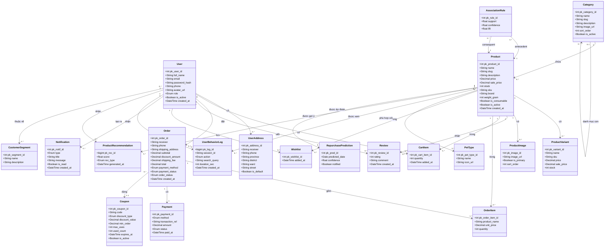

# Entity Class Diagram - Biểu đồ lớp thực thể

Mô tả các lớp thực thể (Entity) trong hệ thống và quan hệ giữa chúng.
Tập trung vào dữ liệu, chưa có methods.

---

```mermaid
classDiagram

    class User {
        +int pk_user_id
        +String full_name
        +String email
        +String password_hash
        +String phone
        +String avatar_url
        +Enum role
        +Boolean is_active
        +DateTime created_at
    }

    class UserAddress {
        +int pk_address_id
        +String receiver
        +String phone
        +String province
        +String district
        +String ward
        +String street
        +Boolean is_default
    }

    class Category {
        +int pk_category_id
        +String name
        +String slug
        +String description
        +String image_url
        +int sort_order
        +Boolean is_active
    }

    class PetType {
        +int pk_pet_type_id
        +String name
        +String icon_url
    }

    class Product {
        +int pk_product_id
        +String name
        +String slug
        +String description
        +Decimal price
        +Decimal sale_price
        +int stock
        +String sku
        +String brand
        +int weight_gram
        +Boolean is_consumable
        +Boolean is_active
        +DateTime created_at
    }

    class ProductVariant {
        +int pk_variant_id
        +String name
        +String sku
        +Decimal price
        +Decimal sale_price
        +int stock
    }

    class ProductImage {
        +int pk_image_id
        +String image_url
        +Boolean is_primary
        +int sort_order
    }

    class Review {
        +int pk_review_id
        +int rating
        +String comment
        +DateTime created_at
    }

    class CartItem {
        +int pk_cart_item_id
        +int quantity
        +DateTime added_at
    }

    class Coupon {
        +int pk_coupon_id
        +String code
        +Enum discount_type
        +Decimal discount_value
        +Decimal min_order
        +int max_uses
        +int used_count
        +DateTime expires_at
        +Boolean is_active
    }

    class Order {
        +int pk_order_id
        +String receiver
        +String phone
        +String shipping_address
        +Decimal subtotal
        +Decimal discount_amount
        +Decimal shipping_fee
        +Decimal total
        +Enum payment_method
        +Enum payment_status
        +Enum order_status
        +DateTime created_at
    }

    class OrderItem {
        +int pk_order_item_id
        +String product_name
        +Decimal unit_price
        +int quantity
    }

    class Payment {
        +int pk_payment_id
        +Enum method
        +String transaction_ref
        +Decimal amount
        +Enum status
        +DateTime paid_at
    }

    class UserBehaviorLog {
        +bigint pk_log_id
        +String session_id
        +Enum action
        +String search_query
        +int duration_sec
        +DateTime created_at
    }

    class ProductRecommendation {
        +bigint pk_rec_id
        +float score
        +Enum rec_type
        +DateTime generated_at
    }

    class AssociationRule {
        +int pk_rule_id
        +float support
        +float confidence
        +float lift
    }

    class CustomerSegment {
        +int pk_segment_id
        +String name
        +String description
    }

    class RepurchasePrediction {
        +int pk_pred_id
        +Date predicted_date
        +float confidence
        +Boolean notified
    }

    class Wishlist {
        +int pk_wishlist_id
        +DateTime added_at
    }

    class Notification {
        +int pk_notif_id
        +Enum type
        +String title
        +String message
        +Boolean is_read
        +DateTime created_at
    }

    %% Quan he
    User "1" --> "0..*" UserAddress : có
    User "1" --> "0..*" CartItem : có
    User "1" --> "0..*" Order : đặt
    User "1" --> "0..*" Review : viết
    User "1" --> "0..*" Wishlist : lưu
    User "1" --> "0..*" Notification : nhận
    User "1" --> "0..*" UserBehaviorLog : tạo ra
    User "1" --> "0..*" ProductRecommendation : nhận
    User "0..*" --> "0..*" CustomerSegment : thuộc về

    Category "1" --> "0..*" Product : chứa
    Category "0..1" --> "0..*" Category : danh mục con

    Product "1" --> "0..*" ProductVariant : có
    Product "1" --> "0..*" ProductImage : có
    Product "1" --> "0..*" Review : nhận
    Product "1" --> "0..*" CartItem : trong
    Product "1" --> "0..*" OrderItem : trong
    Product "1" --> "0..*" Wishlist : trong
    Product "0..*" --> "0..*" PetType : phù hợp với
    Product "1" --> "0..*" UserBehaviorLog : được xem
    Product "1" --> "0..*" ProductRecommendation : được gợi ý
    Product "1" --> "0..*" RepurchasePrediction : được dự đoán

    Order "1" --> "1..*" OrderItem : gồm
    Order "1" --> "1" Payment : có
    Order "0..*" --> "0..1" Coupon : dùng

    AssociationRule "0..*" --> "1" Product : antecedent
    AssociationRule "0..*" --> "1" Product : consequent
```
