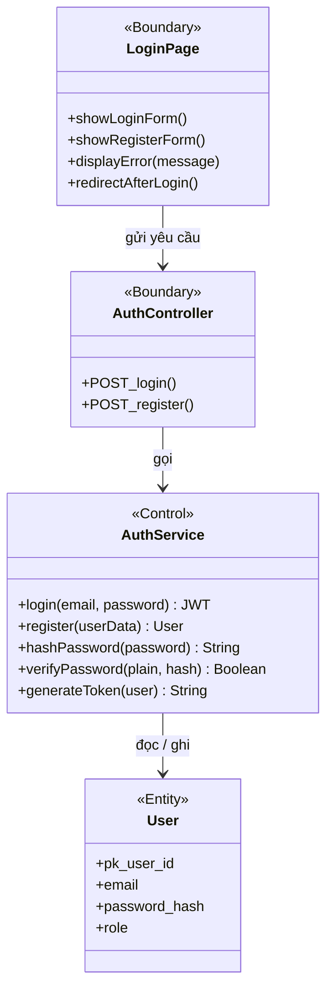
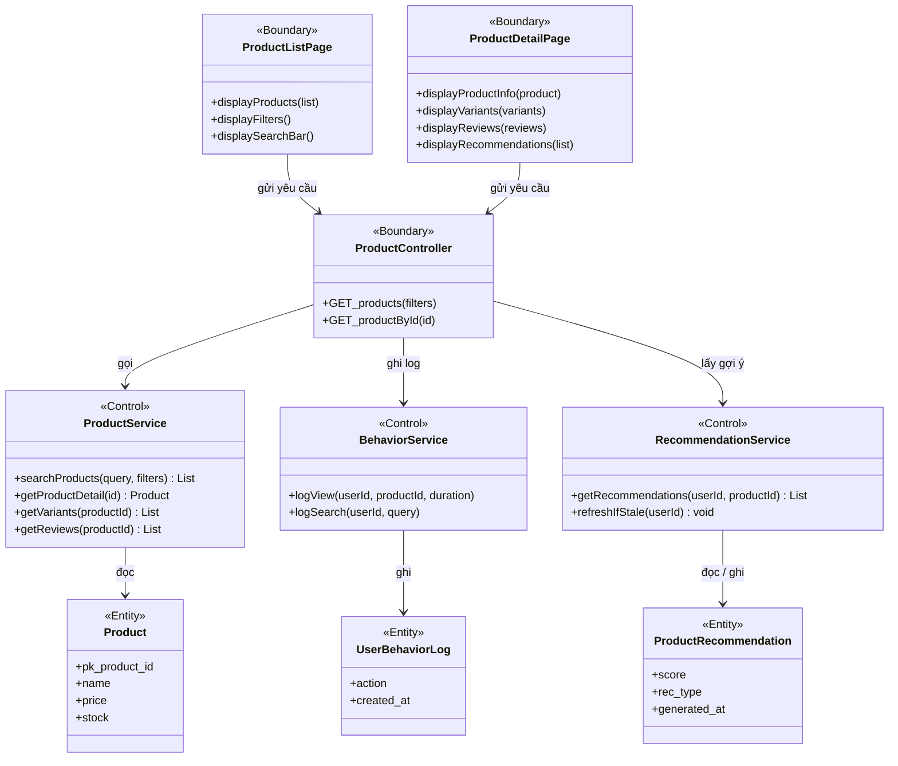
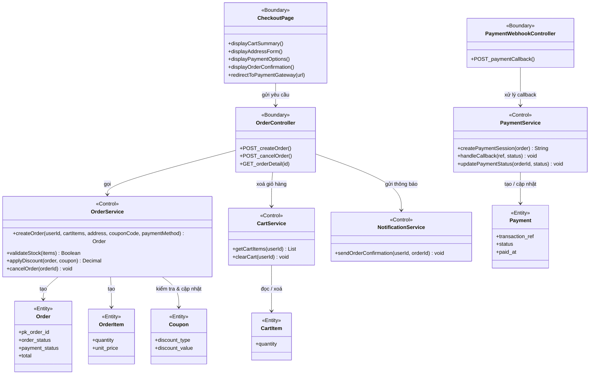
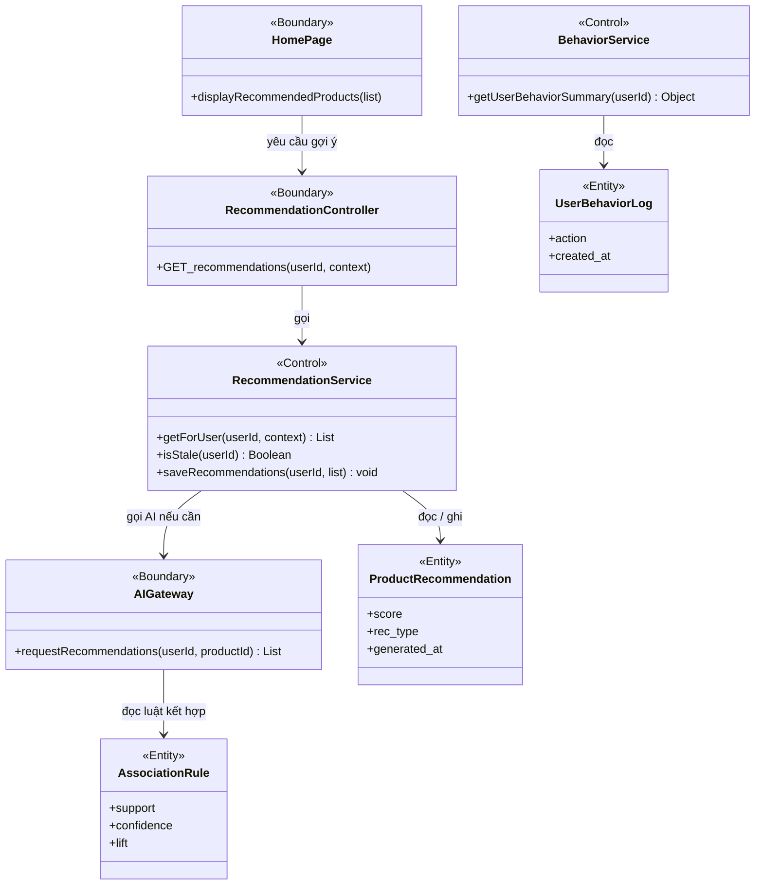

# VOPC - View Of Participating Classes

Mô tả các lớp tham gia vào từng use case theo mô hình BCE:
- **Boundary**: lớp giao tiếp với actor (UI, API Controller)
- **Control**: lớp xử lý logic nghiệp vụ (Service)
- **Entity**: lớp dữ liệu (Model/Entity)

---

## 1. Use Case: Đăng ký / Đăng nhập

---

## 2. Use Case: Tìm kiếm & Xem sản phẩm

---

## 3. Use Case: Đặt hàng & Thanh toán

---

## 4. Use Case: Gợi ý sản phẩm AI

