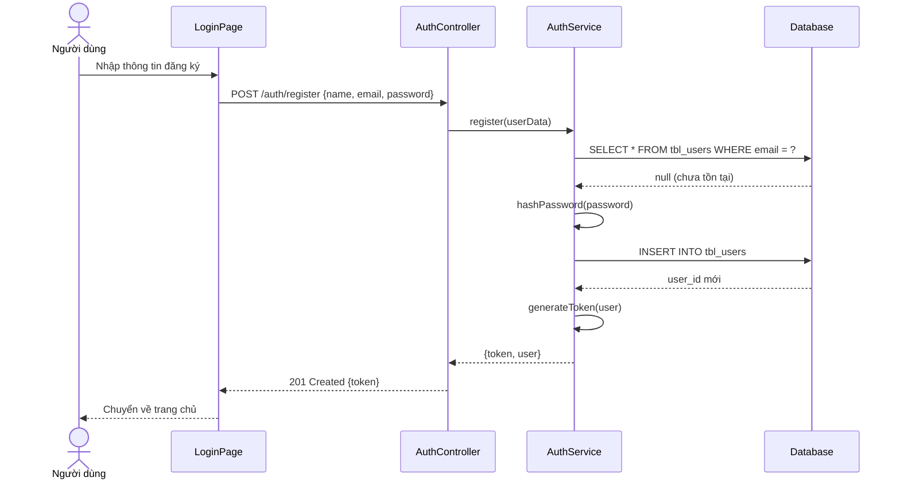
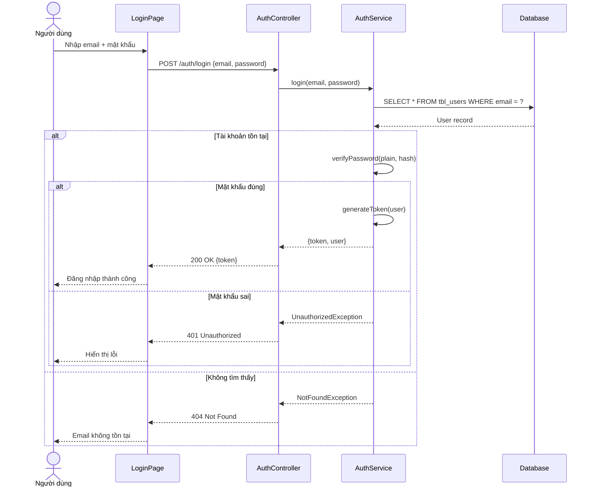
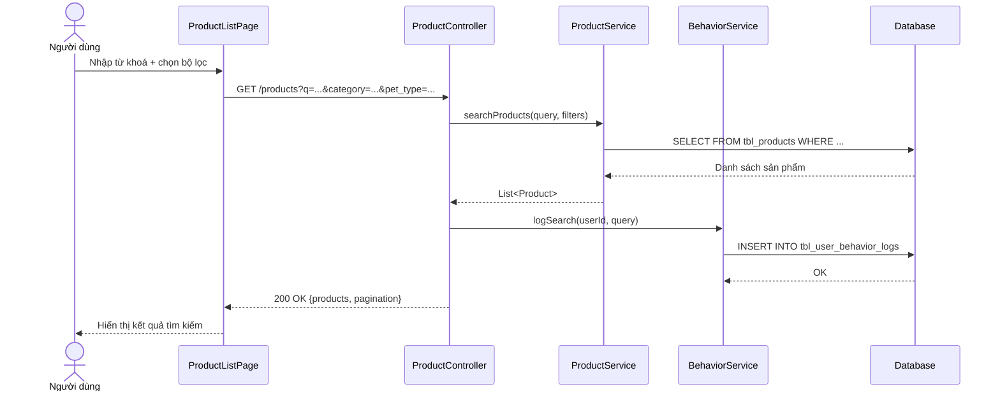
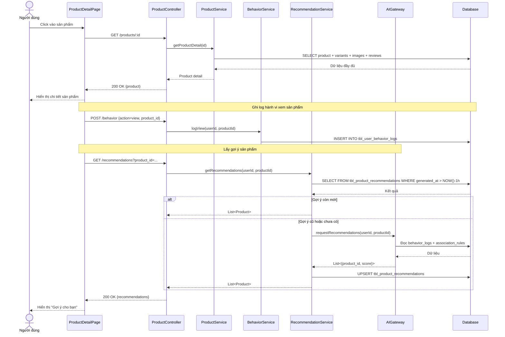
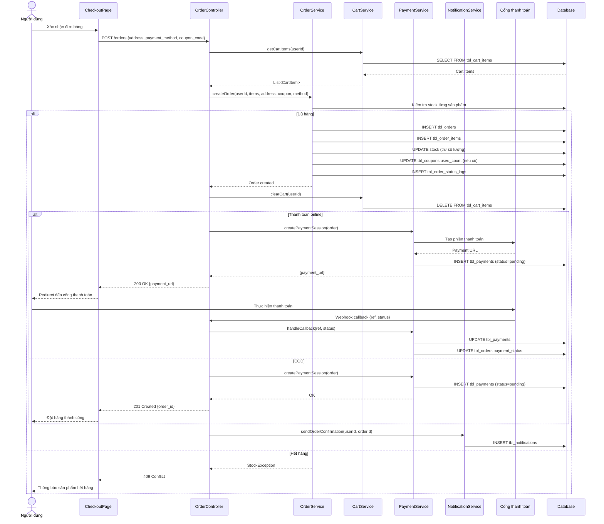
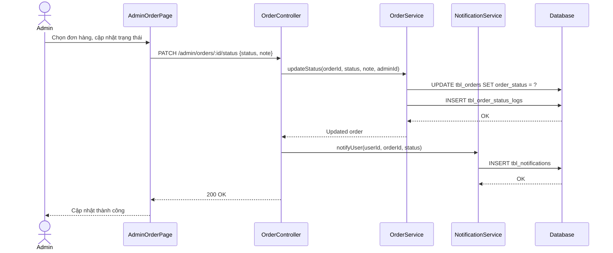

# Sequence Diagram - Biểu đồ tuần tự (UML)

Mô tả thứ tự trao đổi thông điệp giữa các đối tượng khi thực hiện use case.

---

## 1. Đăng ký tài khoản

---

## 2. Đăng nhập

---

## 3. Tìm kiếm sản phẩm

---

## 4. Xem chi tiết sản phẩm & nhận gợi ý

---

## 5. Đặt hàng & Thanh toán

---

## 6. Admin cập nhật trạng thái đơn hàng

