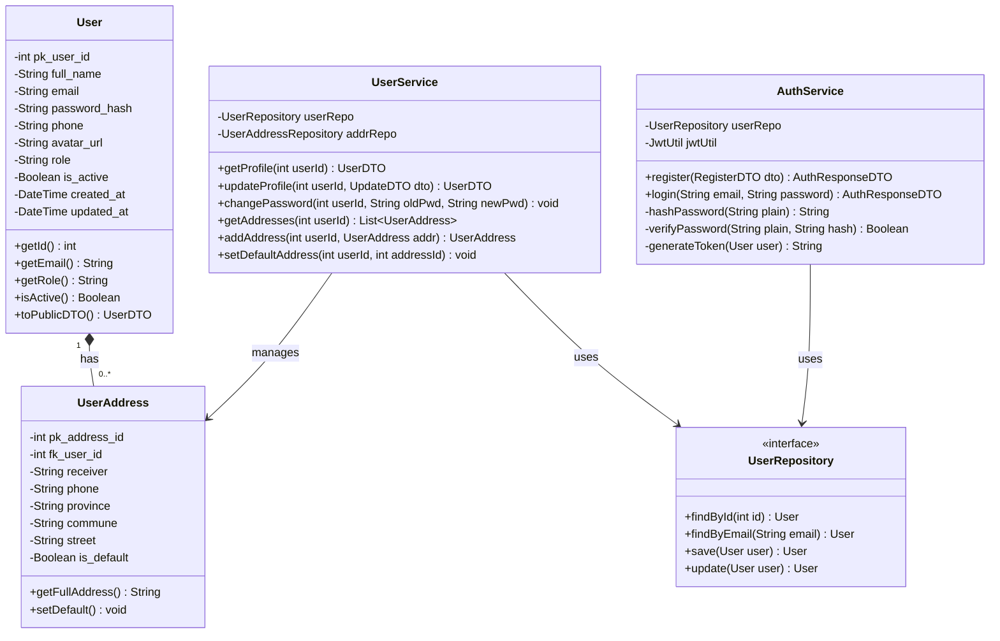
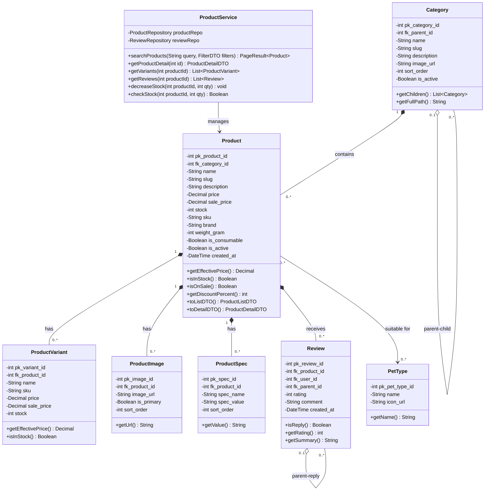
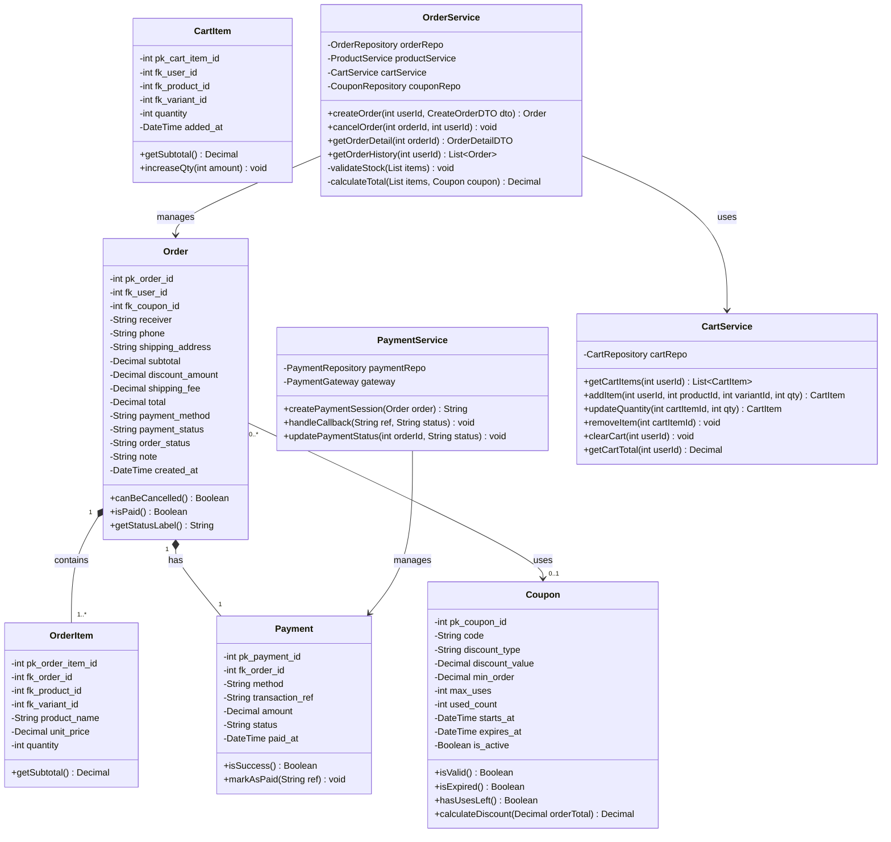
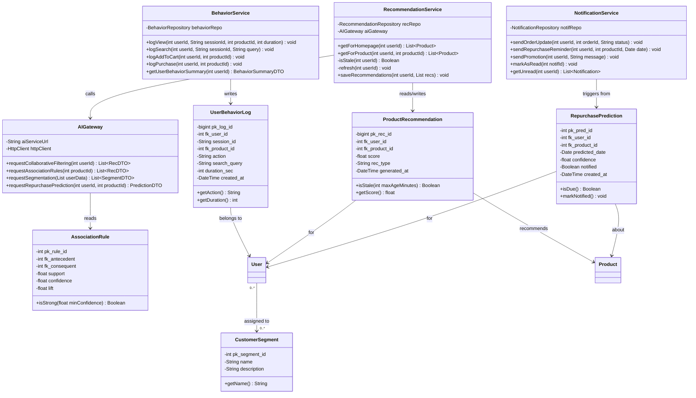

# Detailed Class Diagram - Biểu đồ lớp chi tiết

Mô tả đầy đủ attributes, methods, visibility và quan hệ giữa các lớp.
Visibility: + public, - private, # protected

---

## 1. Nhóm Auth & User

---

## 2. Nhóm Sản phẩm & Danh mục

---

## 3. Nhóm Đơn hàng & Thanh toán

---

## 4. Nhóm AI & Hành vi

